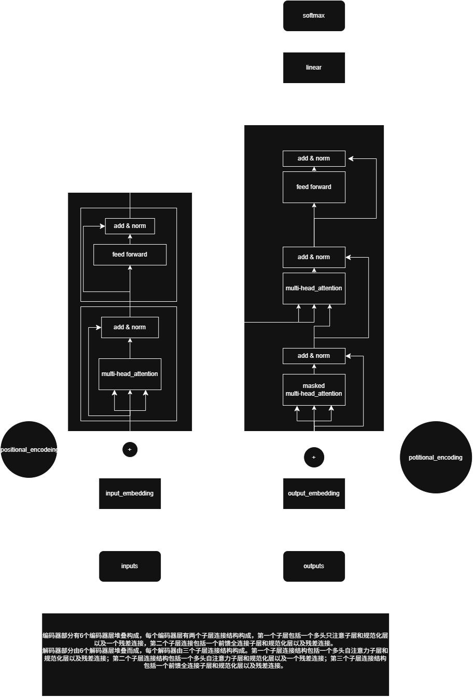

# Transformer 架构学习

一个面向初学者的 Transformer 架构学习项目。项目只关注 Transformer 本体的结构、数据流动和关键组件，不涉及 Hugging Face 迁移学习、微调等后续内容。

目标不是“能跑通一个训练任务”，而是让你从**词嵌入 → 位置编码 → 注意力 → 编码器 → 解码器 → 输出层**逐层理解 Transformer 到底做了什么。



## 这个项目适合谁

- 已经学过 PyTorch 的基本张量操作，但还看不明白 Transformer 代码的人。
- 想把《Attention Is All You Need》中的图和代码对应起来的人。
- 希望用最少依赖、最小数据集快速跑通一次前向传播的人。

## 项目特点

- 代码从零实现，不调用 `nn.Transformer`，每个组件都有对应 Python 文件。
- 示例按学习顺序拆成 5 步，每一步都能独立运行。
- 文档把“为什么需要这个组件”放在“怎么实现”前面。
- 不训练模型，因此不需要 GPU，也不需要真实语料，随机张量即可演示。

## 目录结构

```text
transformer-learning/
├── assets/
│   └── transformer.png          # 架构图
├── docs/
│   ├── 00_学习路线.md
│   ├── 01_输入嵌入与位置编码.md
│   ├── 02_注意力机制.md
│   ├── 03_编码器.md
│   ├── 04_解码器.md
│   ├── 05_完整模型与常见问题.md
│   └── 06_代码地图.md
├── examples/
│   ├── demo_01_input.py
│   ├── demo_02_attention.py
│   ├── demo_03_encoder.py
│   ├── demo_04_decoder.py
│   └── demo_05_full_model.py
├── src/
│   ├── embedding.py
│   ├── attention.py
│   ├── feedforward.py
│   ├── layer_norm.py
│   ├── sublayer.py
│   ├── encoder.py
│   ├── decoder.py
│   ├── generator.py
│   ├── model.py
│   └── utils.py
├── tests/
│   └── test_transformer.py
├── main.py
├── requirements.txt
├── LICENSE
└── README.md
```

## 快速开始

环境要求：Python 3.10+，PyTorch 2.0+。

```bash
pip install -r requirements.txt
```

运行完整模型前向传播：

```bash
python main.py
```

按学习顺序运行示例：

```bash
python -m examples.demo_01_input
python -m examples.demo_02_attention
python -m examples.demo_03_encoder
python -m examples.demo_04_decoder
python -m examples.demo_05_full_model
```

运行测试：

```bash
python -m unittest discover -s tests -v
```

## 建议学习路线

建议按下面的顺序阅读，再配合对应的示例代码：

| 步骤 | 学习内容 | 文档 | 示例 |
| --- | --- | --- | --- |
| 1 | 词嵌入、位置编码 | `docs/01_输入嵌入与位置编码.md` | `demo_01_input.py` |
| 2 | 自注意力、多头注意力、掩码 | `docs/02_注意力机制.md` | `demo_02_attention.py` |
| 3 | 编码器层、编码器堆叠 | `docs/03_编码器.md` | `demo_03_encoder.py` |
| 4 | 掩码自注意力、交叉注意力、解码器 | `docs/04_解码器.md` | `demo_04_decoder.py` |
| 5 | 完整模型、输出层 | `docs/05_完整模型与常见问题.md` | `demo_05_full_model.py` |

完整学习总览见 [`docs/00_学习路线.md`](./docs/00_学习路线.md)，代码与文件对应关系见 [`docs/06_代码地图.md`](./docs/06_代码地图.md)。

## 核心公式速览

缩点积注意力：

```text
Attention(Q, K, V) = softmax(Q K^T / sqrt(d_k)) V
```

多头注意力：

```text
MultiHead(Q, K, V) = Concat(head_1, ..., head_h) W^O
head_i = Attention(Q W_i^Q, K W_i^K, V W_i^V)
```

位置编码：

```text
PE(pos, 2i)   = sin(pos / 10000^(2i / d_model))
PE(pos, 2i+1) = cos(pos / 10000^(2i / d_model))
```

## 常见名词对照

| 名词 | 作用 |
| --- | --- |
| Token | 经过分词和索引后的最小输入单位 |
| Embedding | 把 token 索引变成稠密向量 |
| Positional Encoding | 给模型补充位置信息 |
| Self-Attention | 让一个序列内部建立联系 |
| Masked Self-Attention | 让解码器不能“偷看未来” |
| Cross-Attention | 让解码器关注编码器输出 |
| Feed-Forward | 对每个位置独立做非线性加工 |
| Residual Connection | 残差连接，缓解深层网络梯度问题 |
| Layer Normalization | 层规范化，稳定训练 |

## 说明

本仓库刻意排除迁移学习、预训练模型调用、训练和推理工程化内容。当前阶段只做一件事：把 Transformer 架构本身讲清楚、跑起来。

## License

[MIT](./LICENSE)
